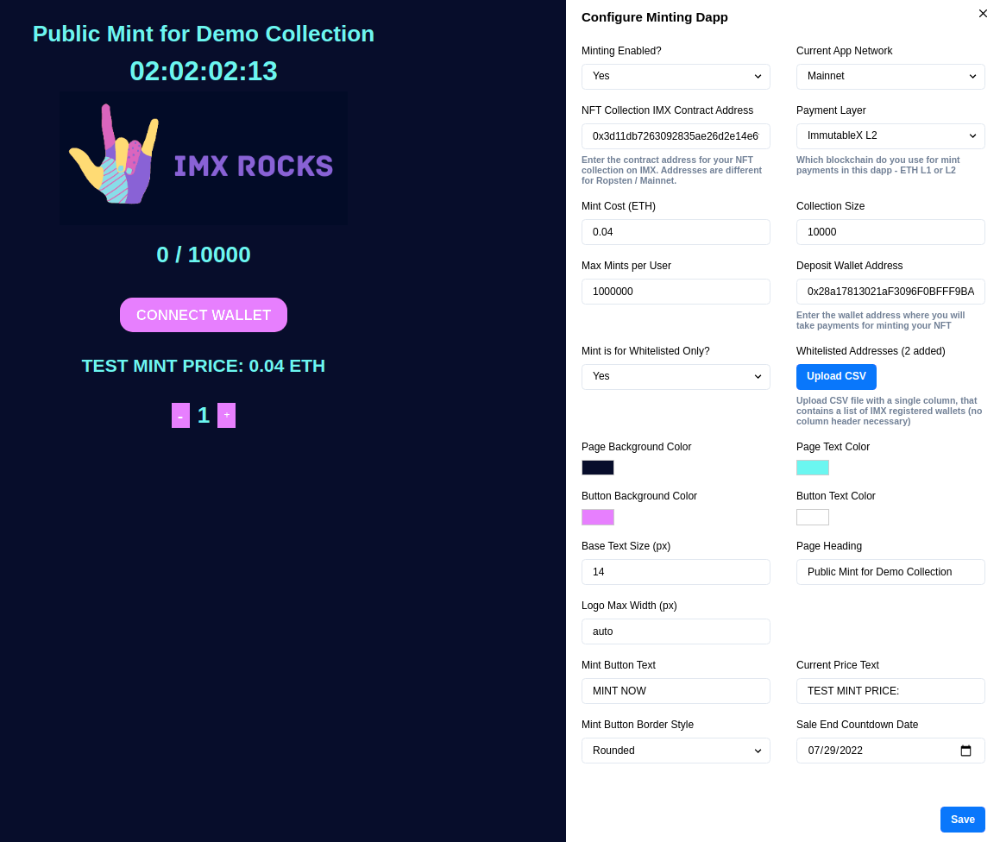

## IMX No-code Minting Frontend Dapp

&nbsp;



&nbsp;

This is a no-code minting frontend dapp for ImmutableX, which lets you spin up an NFT minting dapp for your campaigns without needing to have any coding knowledge. All you need to do is follow the steps below:


1\. Install Node.js on your computer or server.

2\. Clone this project from the repository and install its dependencies:

```bash
npm install
```

3\. Copy **config.example.js** to **config.js**

4\. Build the project for development:

```bash
npm run dev
```

5\. Configure your minting dapp from UI interface and once you're ready, build it for deployment using this command:

```bash
npm run build
```

6\. To change the logo just swap the logo inside **public/images/logo.png** with your own logo. Make sure to use the same naming - **logo.png**

7\. Then export the minting dapp as a static HTML / CSS / JS website so it doesn't require you to host it on a server with Node.js, this way you can even use a simple shared hosting for deployment! Use the following command:

```bash
npm run export
```

8\. After exporting you will see a new folder created inside your root directory called - **/out**. Just copy the contents of this folder to your hosting provider of choice and you're ready to go! If you require any changes to your minting dapp, change them locally and re-deploy.

#

*If you need any custom development or consultancy for your project you can contact me at **iliyan#1066** on Discord.* 

